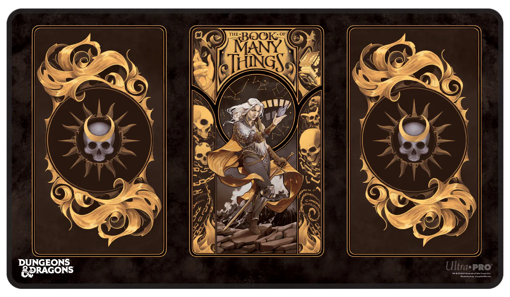
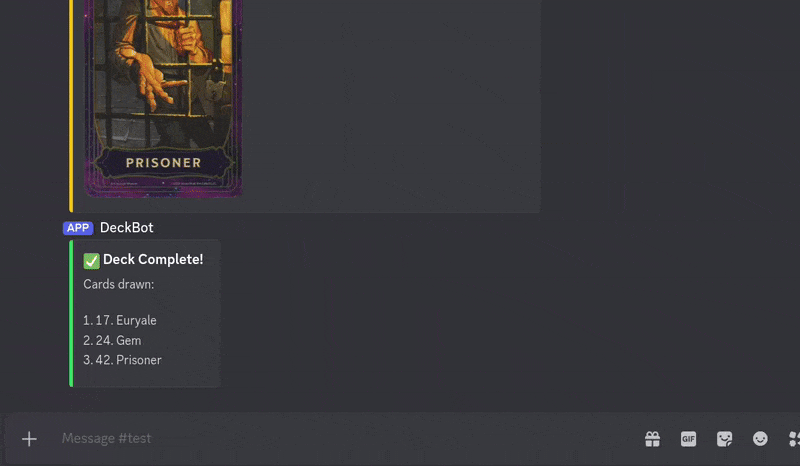

<p align="center">
  
  
  
  
</p>


# Deck of Many Things Discord Bot 

An interactive Discord bot inspired by the legendary **Deck of Many Things** from *Dungeons & Dragons*.  
Built as a personal learning project, this bot explores Discord bot development, UI interactions, and structured game session logic.

Users can draw cards directly inside Discord through a clean, immersive experience powered by embeds, buttons, and modern Discord commands.

---

## About the Deck of Many Things

The **Deck of Many Things** is one of the most iconic magical artifacts in D&D.  
Each card draw can dramatically change the course of an adventure - offering:

- Powerful rewards  
- Sudden curses  
- Unexpected chaos  
- Campaign-altering twists  

It’s a classic storytelling tool used by Dungeon Masters to introduce risk, mystery, and excitement.

---

## Project Motivation

This project was created to bring the Deck of Many Things into Discord as an engaging, interactive experience.

With this bot, players can:

- Start a deck session with `/deck`
- Declare how many cards they intend to draw
- Reveal cards one at a time through button-based interaction
- View results in rich embedded card displays
- End a session early, triggering remaining draws automatically

This makes it useful for:

- Online D&D campaigns  
- Roleplay servers  
- Community mini-games  
- Learning Discord application development  

---

## Features

- Modern **Slash Command Support** (`/deck`)
- Modal-based user input (popup prompt)
- Interactive buttons:
  - Draw Next Card  
  - Stop Drawing  
- Rich embeds with full card descriptions
- Card artwork support (local or hosted image URLs)
- Session-based draw tracking
- Final summary of all drawn cards at the end of a session

---

## Demo



---

## Technical Highlights

This project demonstrates practical software engineering concepts through a real-time interactive application:

- Event-driven Discord bot architecture  
- Asynchronous programming with Python  
- UI-driven command flows using buttons and modals  
- Modular separation of game logic and bot interaction  
- Clean state handling across multi-step sessions  

It reflects strong foundations in:

- Backend development  
- API-based interaction systems  
- User-focused application design  
- Maintainable project structure  

---

## Tech Stack

Built using:

- **Python 3**
- **discord.py (2.x)**
  - Slash commands (`app_commands`)
  - UI Views, Buttons, and Modals
- **Discord API**
- **python-dotenv** for secure token management
- Modular architecture (`src/data/`) for deck logic and card data

---

## What I Learned

Developing and deploying this bot provided hands-on experience with:

- Discord bot development and command handling  
- Building interactive user flows with modern Discord UI components  
- Managing session state across asynchronous events  
- Designing clean embed-based user experiences  
- Structuring a Python project professionally  
- Working with external assets such as hosted card artwork  

It also introduced real deployment workflows, including:

- Environment variable management  
- Cloud hosting platforms (Railway/Render)  
- Debugging production runtime issues through logs  

---

## Running Locally

To run the bot on your own machine:

---

### 1. Clone the Repository

```bash
git clone https://github.com/your-username/deck-bot.git
cd deck-bot

# Install Dependencies

pip install -r requirements.txt

# Create a .env File
# Inside the project folder, create a file named .env:

DISCORD_TOKEN=your_bot_token_here

# Run the Bot

python main.py / python -m src.main
# Basically depending on where your main.py is

# Use in Discord
# Once the bot is online, type:

/deck
```

# Future Improvements

Planned enhancements include:
- Automated handling of card effects (beyond descriptions)
- Multi-user session support
- Deck reshuffling and draw history tracking
- Campaign logging features
- Configurable house rules and custom decks


# Disclaimer

This is a fan-made, non-commercial project created purely for learning and entertainment.

All rights, names, and concepts related to the Deck of Many Things belong to:

Wizards of the Coast (Dungeons & Dragons)

I do not claim ownership of any official D&D intellectual property.


# Author

Developed by Saksham Raj
A hobby project combining software engineering practice with game design inspiration and interactive Discord development.